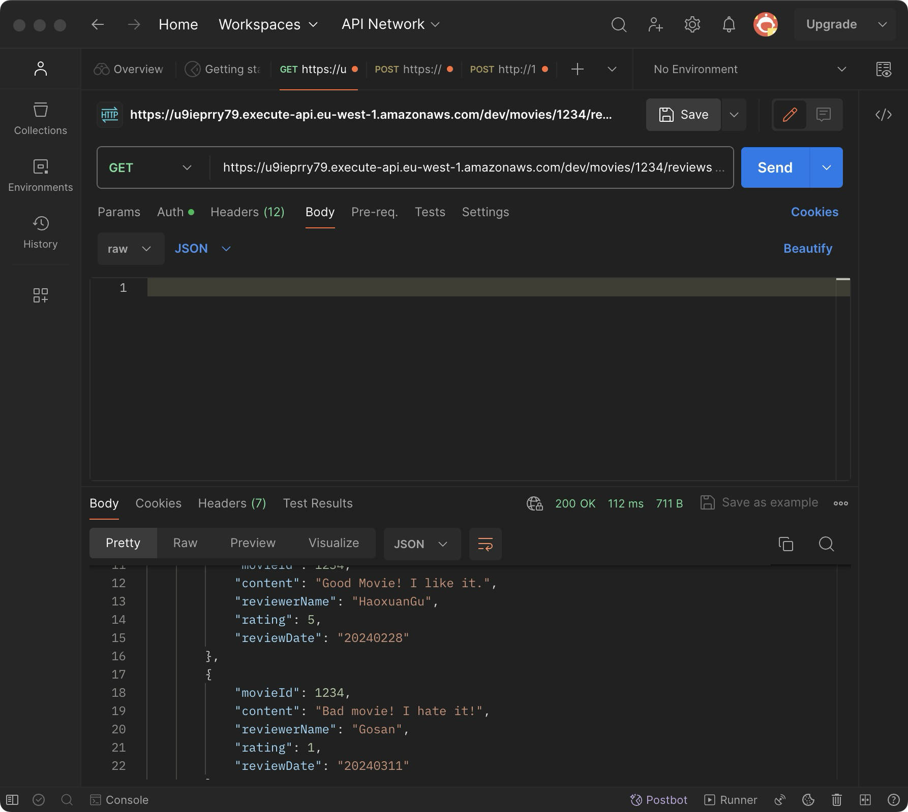

# Distributed System Assignment01
Student Name: HaoxuanGu  
Student Id: 20100200  
Lecturer: Diarmuid O'Connor  
Demo: https://www.youtube.com/watch?v=mMEKl478ABo
## Api
Auth-API:  
POST /auth/signup  - User signup  
POST /auth/confirm_signup - User signup confirm  
POST /auth/signin - User signin  
POST /auth/signout - User signout  
App-Api  
Authenticated
POST /movies/reviews - Add a movie review.  
PUT /movies/{movieId}/reviews/{reviewerName} - Update the text of a review.  
Public  
GET /movies - Get all movie details.   
GET /movies/{movieId} - Get movie details by movie Id.  
GET /movies/{movieId}/reviews - Get all movie reviews by movie Id.  
GET /movies/{movieId}/reviews?minRating=n - Get the reviews for the specified movie with a rating greater than the minRating.  
GET /movies/{movieId}/reviews/{reviewerName} - Get the review written by the named reviewer for the specified movie.   
GET /movies/{movieId}/reviews/{year} - Get the reviews written in a specific year for a specific movie.  
GET /reviews/{reviewerName} - Get all the reviews written by a specific reviewer.  
  
  

### Auth-Api

#### POST /auth/signup  - User signup  
   
#### POST /auth/confirm_signup - User signup confirm  

#### POST /auth/signin - User signin  

#### POST /auth/signout - User signout  

### App-Api

#### Only authenticatedusers are allowed to perform:  
 
##### POST /movies/reviews - Add a movie review.  

##### PUT /movies/{movieId}/reviews/{reviewerName} - Update the text of a review.  

#### Public:  
##### GET /movies - Get all movie details.  

##### GET /movies/{movieId} - Get movie details by movie Id. 
 
##### GET /movies/{movieId}/reviews - Get all movie reviews by movie Id.  

##### GET /movies/{movieId}/reviews?minRating=n - Get the reviews for the specified movie with a rating greater than the minRating. 

##### GET /movies/{movieId}/reviews/{reviewerName} - Get the review written by the named reviewer for the specified movie.  

##### GET /movies/{movieId}/reviews/{year} - Get the reviews written in a specific year for a specific movie.  

##### GET /reviews/{reviewerName} - Get all the reviews written by a specific reviewer.  
